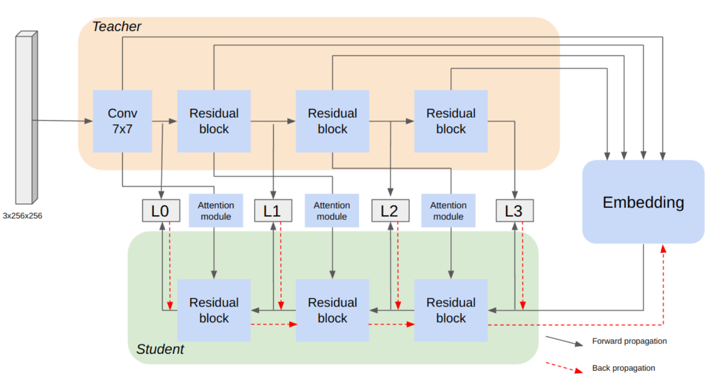

<p align="center">
  <h1><center> DBFAD </center></h1>
</p>

## Official implementation of the paper : "Distillation-based fabric anomaly detection"
Article : https://arxiv.org/pdf/2401.02287.pdf


<p align="center">
  
</p>


## Getting Started

You will need [Python 3.10+](https://www.python.org/downloads) and the packages specified in _requirements.txt_.

Install packages with:

```
$ pip install -r requirements.txt
```

## Configure and Run
To run the code, please download the MVTEC AD dataset and place it in dataset/MVTEC  
Link to download the dataset : https://www.mvtec.com/company/research/datasets/mvtec-ad 

To run train and test the model : 
```
python main.py 
```
To modify the object categories or hyperparameters, you can modify the main.py and the KD_ReverseResidual.py files.

## Citation
Please cite our paper in your publications if it helps your research. Even if it does not, you are welcome to cite us.

    @article{thomine2024distillation,
    title={Distillation-based fabric anomaly detection},
    author={Thomine, Simon and Snoussi, Hichem},
    journal={Textile Research Journal},
    volume={94},
    number={5-6},
    pages={552--565},
    year={2024},
    publisher={SAGE Publications Sage UK: London, England}
    }


## License

This project is licensed under the MIT License.